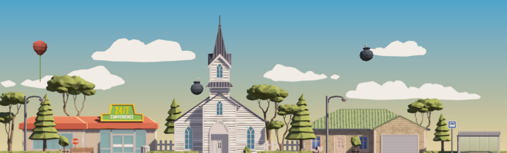

# 🎈 Unity Balloon Trouble – Physics & Effects Challenge

This Unity mini-game combines physics, scrolling backgrounds, and visual/audio effects to create a fun and educational challenge. The player controls a balloon that rises through the sky, collects coins, and avoids bombs. But watch out! The project is filled with bugs — it’s up to you to fix them!

---

## 📸 Screenshots

### 🎮 Game View:

---

## 🎯 Challenge Overview

### Objective:
- 🎈 Guide the balloon upward
- 💰 Collect Money tokens
- 💣 Avoid bombs
- 🎮 Simulate upward movement using a continuously scrolling background

---

## ✅ Challenge Outcome

- Holding the Spacebar makes the balloon float upward (`Rigidbody.AddForce`)
- The background scrolls seamlessly to simulate vertical motion
- **Money** and **Bomb** objects spawn at random intervals (`InvokeRepeating()`)
- When the balloon collides with money:
  - 🎆 A particle effect is triggered
  - 🔊 A sound effect is played
- When the balloon collides with a bomb:
  - 💥 An explosion effect is triggered
  - ⛔ Background movement stops (game over)

---

## 🧠 Key Concepts Learned

| Concept                     | Description                                                |
|-----------------------------|-------------------------------------------------------------|
| `Rigidbody.AddForce()`      | Makes the balloon float upward                             |
| `Input.GetKey(KeyCode.Space)` | Detects if the spacebar is held down                     |
| `InvokeRepeating()`         | Spawns objects at regular intervals                        |
| `Random.Range()`            | Randomly determines spawn position and object type         |
| `OnCollisionEnter()`        | Detects collisions with money or bombs                     |
| `ParticleSystem`            | Plays visual effects                                       |
| `AudioSource.PlayOneShot()` | Plays sound effects                                        |
| `Transform.Translate()`     | Moves the background continuously                          |

---

## 🗂️ Project Structure
